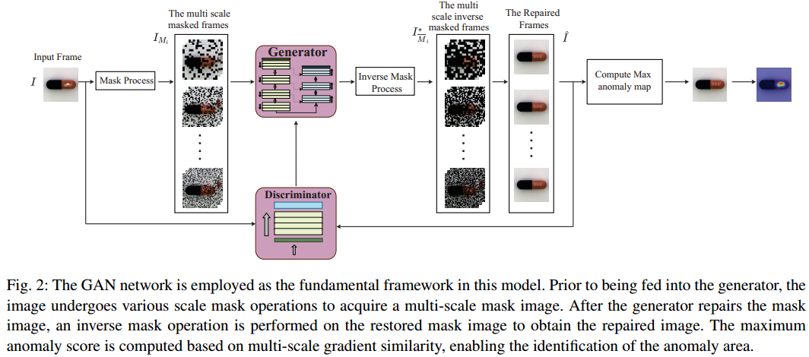

## Industrial Surface Defect Detection By Multi-Scale Inpainting GAN

## PipeLine
 

## Prerequisites
* PyTorch 1.5
* sklearn, matplotlib
* kornia ( incompatible with PyTorch>=1.6.0 so far )  

## Data Preparation
Download the raw data from [MVTec AD](https://www.mvtec.com/company/research/datasets/mvtec-ad/) . Then put them under the data directory:

   -data\  
      -mvtec_anomaly_detection\  
        -bottle\

​        -cable\
​         ...
​	  license.txt

​	  readme.txt       

https://www.mvtec.com/company/research/datasets/mvtec-ad/ MVTec AD

## Training/Testing

To train **RIAD** on `MVTec AD` dataset:
```
python train.py --obj zipper --data_path [your-mvtec_ad-data-path]
```
Then to test:
```
python test.py --obj zipper --data_path [your-mvtec_ad-data-path] --checkpoint_dir [your-saved-weights-path]
```


## Acknowledgement

The framework of our code is extended from the following repositories. We sincerely thank the authors for releasing the codes.

- The framework of our code is based on [RIAD](https://github.com/plutoyuxie/Reconstruction-by-inpainting-for-visual-anomaly-detection.git) .


